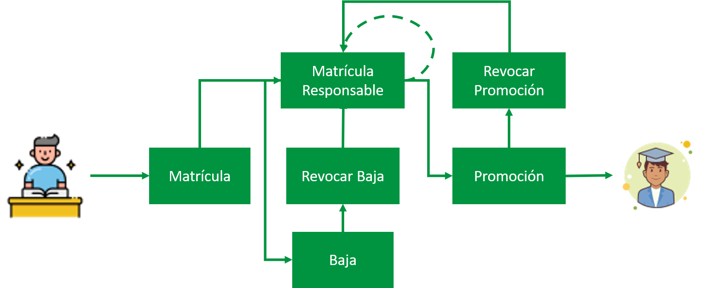
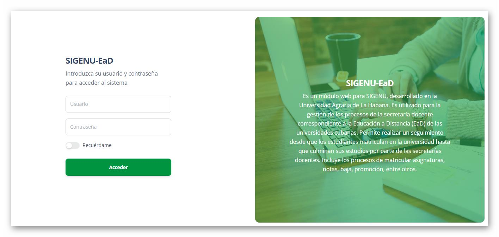
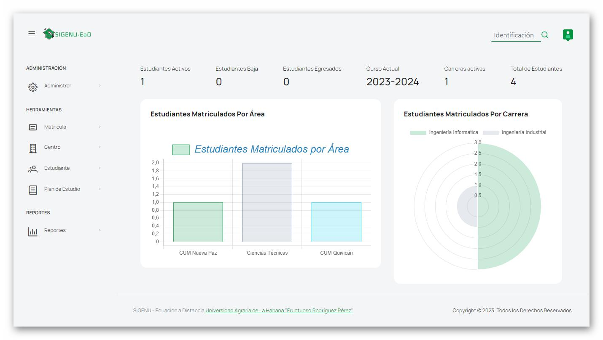
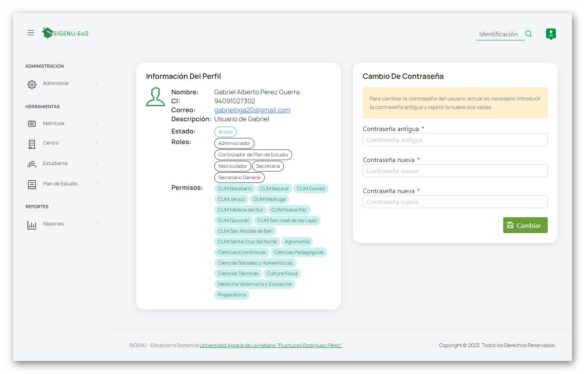
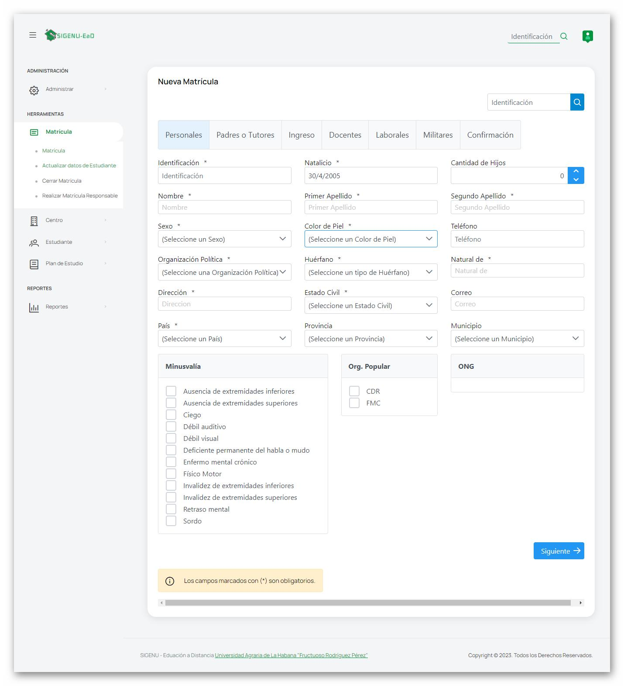
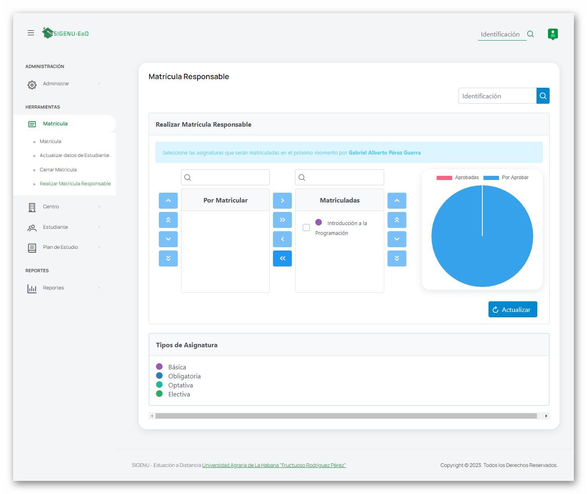

# SIGENU - EaD

## Acerca de

Es un módulo web para SIGENU, desarrollado en la Universidad Agraria de La Habana. Es utilizado para la gestión de los procesos de la secretaría docente correspondiente a la Educación a Distancia (EaD) de las universidades cubanas. Permite realizar un seguimiento desde que los estudiantes matriculan en la universidad hasta que culminan sus estudios por parte de las secretarías docentes. Incluye los procesos de matricular asignaturas, notas, baja, promoción, entre otros.

## Despliegue

SIGENU-EaD ha sido desarrollado con el siguiente entorno:

- Java JDK 18
- PostgreSQL 15
- JBoss Wildfly 27

Para compilar la aplicación se utiliza Apache Maven a través del comando en la terminal:

```shell
$ mvn clean package
```
A través de este comando se podrá obtener el fichero compilado `war` (web archive) y el proyecto compilado (web exploded). Con estos archivos será posible realizar el despliegue del proyecto.

### Despliegue con Docker

Para desplegar la aplicación también se ha consebido la posibilidad de utilizar Docker, en este caso se han implementado dos ficheros para garantizar la compilación y despliegue del sistema de forma automatizada. 

Inicialmente el fichero <em>DOCKERFILE</em> realiza el proceso de compilación del sourcode en un contenedor y posteriormente exporta el compilado a otro contenedor con Jboss Wildfly y realiza el proceso de despliegue. Por si solo este fichero no resulta 100% funcional pues es necesario el uso de un servidor de bases de datos.

Por otro lado está el fichero <em>docker-compose.yml</em> el cual contiene toda la configuración de despliegue del proyecto. En este fichero se concatena el proceso de despliegue contenido en el fichero <em>DOCKERFILE</em>con la creación e inicialización del servidor de bases de datos PostgreSQL. Asimismo, se crea un contenedor de PgAdmin4 para visualizar los datos en la base de datos. El uso de este servicio es adicional y por tanto podría ser innecesario.

Para iniciar el proceso de compilación utilizando el fichero <em>docker-compose.yml</em> primeramente es necesario actualizar dos ficheros de configuración en el proyecto para corregir las rutas de acceso a la base de datos (de direcciones ip a nombres de container). Los cambios son los siguientes:
- <em>applicationContext.xml</em>: En este fichero es necesario modificar la línea `<property name="url" value="jdbc:postgresql://localhost:5432/SIGENU_EaD"/>` por `<property name="url" value="jdbc:postgresql://db:5432/SIGENU_EaD"/>`.
- <em>persistence.xml</em>: En este fichero es necesario modificar la línea `<property name="jakarta.persistence.jdbc.url" value="jdbc:postgresql://localhost:5432/SIGENU_EaD"/>` por `<property name="jakarta.persistence.jdbc.url" value="jdbc:postgresql://db:5432/SIGENU_EaD"/>`.

Una vez realizados los cambios en los ficheros anteriores se puede proceder a la compilación y despliegue del proyecto utilizando el fichero <em>docker-compose.yml</em>, para ello se utiliza el siguiente comando:

```shell
docker-compose up --build docker-compose.yml
```


## Configuración

Este proyecto requiere además de una base de datos. Para ello se de debe utilizar PostgreSQL 15. Debe existir una base de datos con el nombre `SIGENU-EaD`. Para una configuración diferente deben modificarse los ficheros `/src/main/webapp/WEB-INF/applicationContext.xml` que contiene la configuración de autenticación y el fichero  `/src/main/resources/META-INF/persistence.xml` que contiene la configuración de acceso a la base de datos por parte de persistence.

## Flujo de actividades



**Imagen 1**: Descripción del flujo de actividades

## Ejemplos de interfaz







